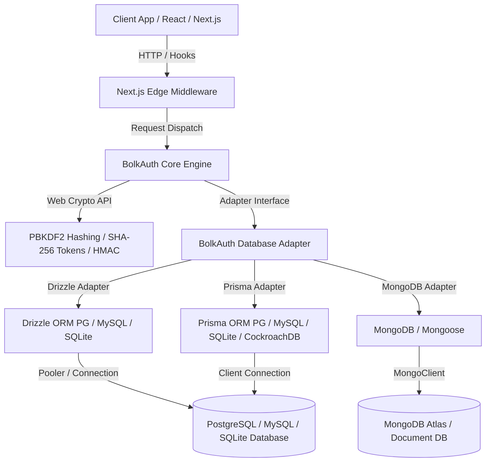

<div align="center">

# ⚡ BolkAuth

**High-performance, self-hosted, type-safe authentication for TypeScript, Next.js, and Node.js.**

*Clerk-like developer experience, zero vendor lock-in, multi-dialect & multi-database support.*

[](https://www.npmjs.com/package/@bolkauth/core)
[](LICENSE)
[](https://github.com/Shreyvats01/bolkauth)
[](https://github.com/Shreyvats01/bolkauth)
[](https://Shreyvats01.github.io/authflow/bolkauth)
[](https://www.typescriptlang.org/)

<br />

[Quickstart](#-quickstart) &bull; [Feature Comparison](#-feature-comparison) &bull; [Multi-Database Support Matrix](#-multi-database-support-matrix) &bull; [Monorepo Packages](#-monorepo-packages) &bull; [Architecture](#-architecture) &bull; [Security Specs](#-security-specifications)

</div>

---

## ✨ Features & Comparison

BolkAuth provides an enterprise-grade, self-hosted authentication engine with Clerk-like developer experience and zero vendor lock-in.

### 📊 Feature Comparison Matrix

| Feature | **BolkAuth** | **Clerk** | **NextAuth / Auth.js** | **Better Auth** |
|---|---|---|---|---|
| **Data Sovereignty** | 🟢 100% Self-Hosted | 🔴 SaaS Lock-in | 🟢 Self-Hosted | 🟢 Self-Hosted |
| **Multi-DB Support** | 🟢 PG, MySQL, SQLite, MongoDB, CockroachDB | 🔴 SaaS Managed | 🟡 Relational focus | 🟡 Relational focus |
| **Multi-Dialect Scaffolding** | 🟢 Drizzle & Prisma multi-dialect | 🔴 N/A | 🔴 Manual setup | 🟡 Basic |
| **Interactive CLI** | 🟢 `@bolkauth/cli` wizard | 🔴 N/A | 🔴 N/A | 🟡 CLI generator |
| **Built-in Onboarding FSM** | 🟢 Built-in state machine | 🟢 Managed UI | 🔴 Manual code | 🔴 Manual code |
| **Web Crypto API (Edge-Ready)**| 🟢 100% Native Web Crypto | 🟡 Partial | 🟡 Varies | 🟢 Web Crypto |
| **Headless React Hooks** | 🟢 Fully unstyled hooks | 🔴 Pre-styled UI | 🟡 Basic hooks | 🟢 Unstyled hooks |
| **Pricing Model** | 🟢 Free & Open Source | 🔴 Per-MAU tier | 🟢 Free & Open Source | 🟢 Free & Open Source |

---

## 🗄️ Multi-Database Support Matrix

BolkAuth supports multiple relational and document databases across Drizzle ORM, Prisma, and native MongoDB drivers.

| Database | Adapter(s) | Driver / Client | Support Level | Connection Pooling / Edge | Schema Migration |
|---|---|---|---|---|---|
| **PostgreSQL** | Drizzle, Prisma | `pg`, `postgres.js`, `@neondatabase/serverless` | 🟢 Production | Neon Pooled, PgBouncer, Supabase | `drizzle-kit` / `prisma migrate` |
| **MySQL** | Drizzle, Prisma | `mysql2`, PlanetScale driver | 🟢 Production | PlanetScale HTTP, Serverless Pool | `drizzle-kit` / `prisma migrate` |
| **SQLite** | Drizzle, Prisma | `libsql`, `@libsql/client`, `better-sqlite3` | 🟢 Production | Turso HTTP / Embedded SQLite | `drizzle-kit` / `prisma db push` |
| **MongoDB** | MongoDB Adapter | `mongodb`, `mongoose` | 🟢 Production | MongoDB Atlas Serverless / Pooled | Index auto-creation / Mongo Shell |
| **CockroachDB** | Drizzle, Prisma | `pg`, `@prisma/client` | 🟢 Production | CockroachDB Serverless / PgBouncer | `drizzle-kit` / `prisma migrate` |

---

## 🚀 Quickstart

### 1. Run Interactive CLI Setup

Scaffold BolkAuth configuration and schema models in any project:

```bash
npx @bolkauth/cli init
```

Add database schemas for your chosen ORM and dialect:

```bash
# Add Drizzle PostgreSQL schema
npx @bolkauth/cli add drizzle pg

# Or Prisma MySQL models
npx @bolkauth/cli add prisma mysql

# Or MongoDB connection setup
npx @bolkauth/cli add mongodb
```

### 2. Configure Auth Engine (`lib/auth.ts`)

```ts
import { createBolkAuth } from "@bolkauth/core";
import { createDrizzleAdapter } from "@bolkauth/adapter-drizzle/pg"; // or /mysql, /sqlite, adapter-prisma, adapter-mongodb
import { db } from "./db";

export const auth = createBolkAuth({
  adapter: createDrizzleAdapter(db),
  secret: process.env.BOLKAUTH_SECRET!,
  emailAndPassword: {
    enabled: true,
    minPasswordLength: 8,
  },
  socialProviders: {
    github: {
      clientId: process.env.GITHUB_CLIENT_ID!,
      clientSecret: process.env.GITHUB_CLIENT_SECRET!,
    },
    google: {
      clientId: process.env.GOOGLE_CLIENT_ID!,
      clientSecret: process.env.GOOGLE_CLIENT_SECRET!,
    },
  },
  onboarding: {
    enabled: true,
    requiredForAccess: true,
    redirectUrl: "/onboarding",
  },
});
```

### 3. Next.js API Route Handler (`app/api/auth/[...bolkauth]/route.ts`)

```ts
import { bolkAuthHandler } from "@bolkauth/nextjs";
import { auth } from "@/lib/auth";

export const { GET, POST, PATCH, DELETE } = bolkAuthHandler(auth);
```

### 4. Provider & Middleware Setup

**App Provider (`app/layout.tsx`):**
```tsx
import { BolkAuthProvider } from "@bolkauth/react";

export default function RootLayout({ children }: { children: React.ReactNode }) {
  return (
    <html lang="en">
      <body>
        <BolkAuthProvider config={{ baseURL: "/api/auth" }}>
          {children}
        </BolkAuthProvider>
      </body>
    </html>
  );
}
```

**Edge Middleware (`middleware.ts`):**
```ts
import { bolkAuthMiddleware } from "@bolkauth/nextjs";
import { auth } from "@/lib/auth";

export default bolkAuthMiddleware(auth, {
  signInUrl: "/sign-in",
  onboardingUrl: "/onboarding",
  publicRoutes: ["/", "/sign-in", "/sign-up", "/api/auth"],
});

export const config = {
  matcher: ["/((?!.*\\..*|_next).*)", "/", "/(api|trpc)(.*)"],
};
```

---

## 📦 Monorepo Packages

| Package | Version | Description |
|---|---|---|
| [`@bolkauth/core`](./packages/core) | `0.1.2` | Core auth engine (Web Crypto, Sessions, OAuth 2.0, OTP, Onboarding FSM) |
| [`@bolkauth/react`](./packages/react) | `0.1.2` | Headless React hooks (`useSignIn`, `useSignUp`, `useOAuth`, `useSession`) & Context Provider |
| [`@bolkauth/nextjs`](./packages/nextjs) | `0.1.2` | Next.js App Router handlers (`bolkAuthHandler`), Edge Middleware, & Server Component Helpers |
| [`@bolkauth/adapter-drizzle`](./packages/adapter-drizzle) | `0.1.2` | Multi-dialect Drizzle ORM adapter (`/pg`, `/mysql`, `/sqlite`) and schemas |
| [`@bolkauth/adapter-prisma`](./packages/adapter-prisma) | `0.1.2` | Multi-dialect Prisma ORM adapter & schema models (PostgreSQL, MySQL, SQLite, CockroachDB) |
| [`@bolkauth/adapter-mongodb`](./packages/adapter-mongodb) | `0.1.2` | Native MongoDB & Mongoose adapter for document database setups |
| [`@bolkauth/cli`](./packages/cli) | `0.1.2` | Interactive CLI scaffolding wizard (`init`, `add`, `generate`) |

---

## 🏗️ Architecture



---

## 🔒 Security Specifications

- **Password Hashing**: PBKDF2 with SHA-256 digest, 100,000 iterations, and 16-byte cryptographically secure random salts.
- **Session Security**: 32-byte cryptographically secure random session tokens, hashed via SHA-256 before database storage.
- **Cookie Security**: HTTP-only, `SameSite=Lax`, `Secure` in production, with configurable Max-Age (default: 30 days).
- **CSRF & OAuth 2.0 PKCE**: High-entropy state verification and PKCE code challenge verification for social auth flows.
- **Timing Attack Prevention**: Constant-time secret string comparisons using Web Crypto API.

---

## 📄 License

BolkAuth is open-source software licensed under the **[MIT License](LICENSE)**.
